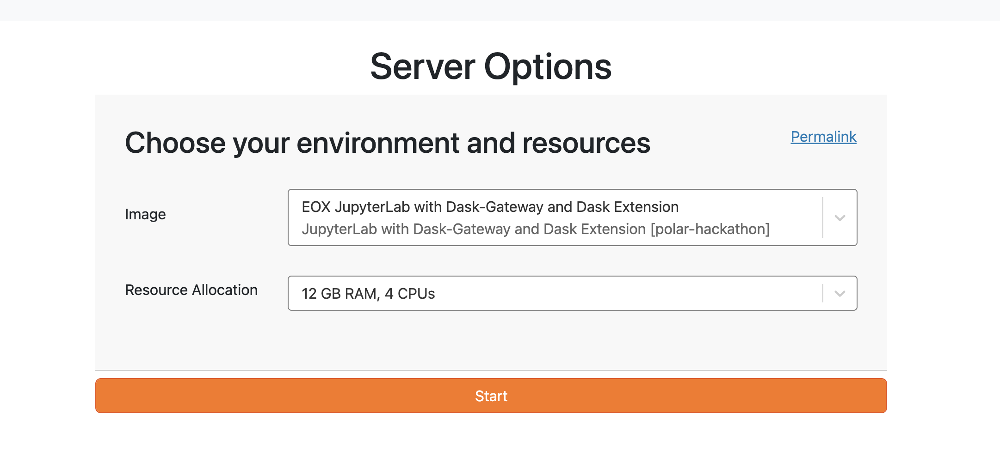
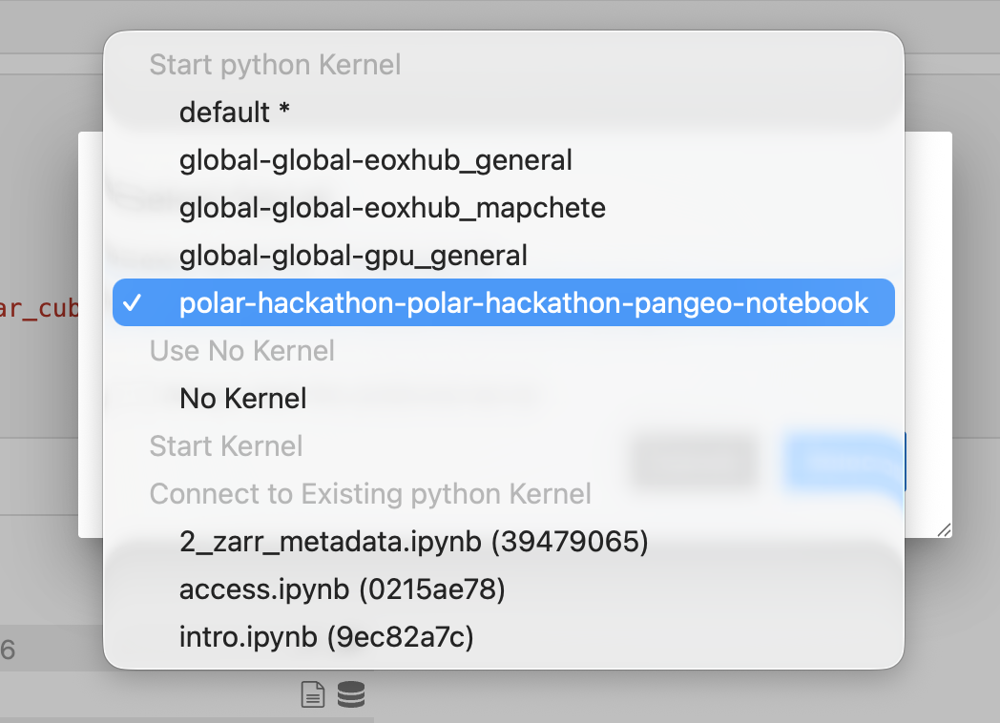

# Setup

## Working Locally

The notebooks assume a Python geospatial environment with common Pangeo tools. A `pixi.toml` is provided in the repository.

If you do not have Pixi installed, see the [Pixi installation guide](https://pixi.sh/latest/installation/).

Create the environment with Pixi:

```bash
pixi install
```

Then start JupyterLab:

```bash
pixi run jupyter lab
```

Network access is only needed for remote object-store reads or optional source downloads. The format tutorials are written so downloaded examples land in `downloaded_data/` and can be regenerated instead of committed.

## Working on EDC (Euro Data Cube) and EarthCODE Workspaces

If you are using the provided cloud platform environment these notebooks and environment will already have all needed packages installed. Furthermore, there is a shared `/bucket/` directory for collaboration.

**You can directly start working in the environment. You can access this cloud environment during the week of the online pre-hackathon and the week after!**

To request an account (only available during the workshop!), use your GitHub account to sign in at: **TBD**.

To log in, you must have a [GitHub account](https://docs.github.com/en/get-started/start-your-journey/creating-an-account-on-github).

We will need to approve access for you to the online workspaces. You can then directly clone and open this workshop by following this link: **TBD**.

Make sure to select the correct environment size: **TBD**. The original environment-selection example is shown below.



See the [introduction to the EDC workspace](./Workspace/workspace.md) for more details.

After you enter the environment and open a notebook, you might be asked to select a kernel. The workshop kernel name is **TBD**.


